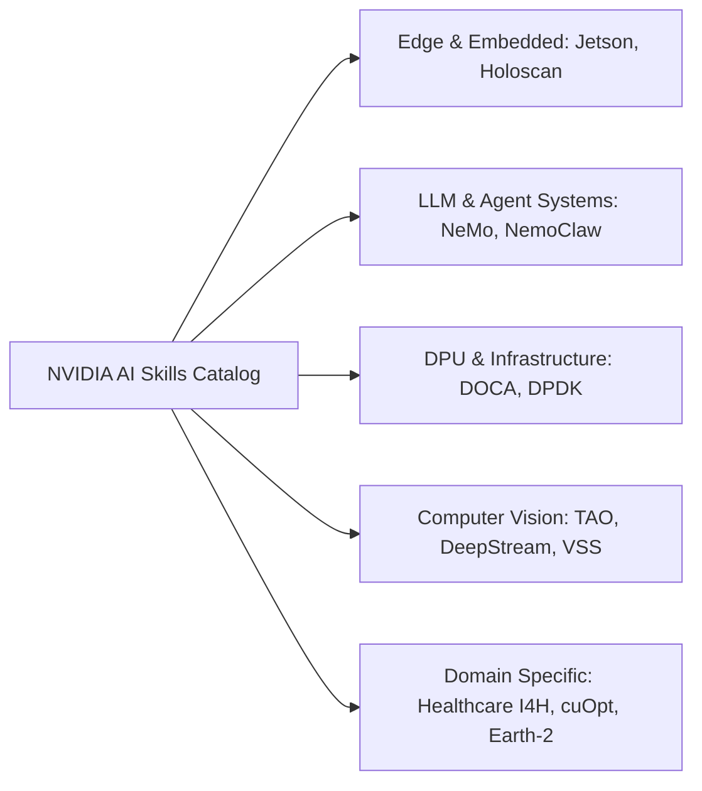

# 🗂️ MCP Cards & NVIDIA AI Skills Catalog

<p align="center">
  <b>English</b> | <a href="README_KO.md">한국어</a>
</p>

<p align="center">
  
  
  
  
</p>

A curated, production-ready knowledge base containing **558 verified Model Context Protocol (MCP) server specification cards** and **NVIDIA AI Agent Skills & Solution Blueprints**. 

Every card is crafted in a standardized, atomic Markdown format optimized for both **human developers** and **autonomous AI agents** (Cursor, Claude Desktop, Windsurf, Antigravity, Cline, and RAG pipelines).

---

## 📑 Table of Contents

- [Overview](#-overview)
- [Repository Structure](#-repository-structure)
- [Card Categories](#-card-categories)
  - [1. Verified MCP Servers (201 Cards)](#1-verified-mcp-servers-201-cards)
  - [2. NVIDIA AI Agent Skills (326 Cards)](#2-nvidia-ai-agent-skills-326-cards)
  - [3. NVIDIA Solution Blueprints (31 Cards)](#3-nvidia-solution-blueprints-31-cards)
- [Card Anatomy & Standard Format](#-card-anatomy--standard-format)
- [Quick Start & Integration Guide](#-quick-start--integration-guide)
- [License](#-license)

---

## 🌟 Overview

As agentic AI workflows and LLM tool calling evolve, connecting LLMs to the right tools and domain procedures requires unambiguous, standardized metadata. 

This repository serves as a **unified catalog** providing:
- **Instant Configuration**: Ready-to-copy `mcpServers` JSON snippets for your IDE / AI Agent.
- **Safety Boundaries**: Input constraints, permission models, and error branching.
- **Agent Skill Chaining**: Actionable guides for combining specialized NVIDIA skills with external MCP services.

---

## 📁 Repository Structure

```tree
mcp-cards/
├── README.md                      # Project documentation & catalog index
├── README_KO.md                   # Korean documentation & catalog index
├── .gitignore                     # Repository whitelist & secret protection
│
├── skills/                        # 527 Skill & MCP Cards
│   ├── mcp-*.md                   # 201 Verified MCP Server Cards (Ponytail, AWS, GCP, Salesforce, etc.)
│   ├── doca-*.md                  # DOCA DPU & High-Performance Networking Skills (~60)
│   ├── jetson-*.md                # Jetson Embedded & Edge AI Skills (~30)
│   ├── nemo-*.md                  # NeMo LLM Training, Guardrails & Agent Skills (~40)
│   ├── tao-*.md                   # TAO Toolkit Computer Vision & Transfer Learning (~50)
│   ├── vss-*.md                   # Video Search & Summarization (VSS) Skills (~15)
│   ├── holoscan-*.md              # Holoscan Real-time Sensor Processing Skills
│   ├── cuopt-*.md                 # cuOpt Route & Logistics Optimization Skills
│   └── ...                        # Healthcare (I4H), Physical AI, Omniverse, TileGym
│
└── blueprints/
    └── cards/                     # 31 End-to-End Enterprise Solution Blueprint Cards
        ├── build-an-enterprise-rag-pipeline.md
        ├── cosmos-dataset-search.md
        ├── generative-virtual-screening-for-drug-discovery.md
        ├── retail-agentic-commerce.md
        └── ...
```

---

## 🏷️ Card Categories

### 1. Verified MCP Servers (201 Cards)

Located under `skills/mcp-*.md`. Each card provides package source, stdio/SSE transport details, required environment variables, and client JSON config:

| Domain | Key MCP Servers | Example Cards |
|---|---|---|
| **🛠️ Developer Tools & Optimization** | Ponytail (Lazy Senior Dev), Apidog, Chrome DevTools, ast-grep, JetBrains | [`mcp-ponytail-lazy-senior-dev.md`](skills/mcp-ponytail-lazy-senior-dev.md), [`mcp-apidog-api-management.md`](skills/mcp-apidog-api-management.md) |
| **🎨 Frontend & UI/Design** | Canva, Storybook, Cypress, Tailwind CSS, Raycast, Figma | [`mcp-canva-design.md`](skills/mcp-canva-design.md), [`mcp-storybook-ui.md`](skills/mcp-storybook-ui.md) |
| **☁️ AWS Cloud & Serverless** | AWS Core, DynamoDB, S3 Storage, Lambda, Bedrock AI, CloudWatch | [`mcp-aws-dynamodb.md`](skills/mcp-aws-dynamodb.md), [`mcp-aws-bedrock-ai.md`](skills/mcp-aws-bedrock-ai.md) |
| **🌐 Google Cloud & Workspace** | GCP Core, BigQuery, Cloud Storage, Vertex AI, Workspace, Maps | [`mcp-google-bigquery.md`](skills/mcp-google-bigquery.md), [`mcp-google-vertex-ai.md`](skills/mcp-google-vertex-ai.md) |
| **🏢 Microsoft Azure & Cloud** | Azure Core, DevOps, Blob Storage, Cosmos DB, Azure OpenAI, DigitalOcean | [`mcp-azure-devops.md`](skills/mcp-azure-devops.md), [`mcp-digitalocean-cloud.md`](skills/mcp-digitalocean-cloud.md) |
| **🏢 Enterprise SaaS & CRM** | Salesforce, Zendesk, PostHog, Mixpanel, Strapi, Contentful, Bitbucket | [`mcp-salesforce-crm.md`](skills/mcp-salesforce-crm.md), [`mcp-posthog-analytics.md`](skills/mcp-posthog-analytics.md) |
| **⚙️ Workflow & Agent Platforms** | n8n Automation, Dify.ai, Flowise AI, Zapier, Make | [`mcp-n8n-automation.md`](skills/mcp-n8n-automation.md), [`mcp-dify-workflow.md`](skills/mcp-dify-workflow.md) |
| **🤖 Frontier AI & Local Serving** | DeepSeek AI, Qwen DashScope, Ollama Local, vLLM Distributed, ElevenLabs, Langfuse | [`mcp-deepseek-ai.md`](skills/mcp-deepseek-ai.md), [`mcp-langfuse-observability.md`](skills/mcp-langfuse-observability.md) |
| **🧠 Memory & Reasoning** | Anthropic Knowledge Graph Memory, Anthropic Sequential Thinking | [`mcp-memory-graph.md`](skills/mcp-memory-graph.md), [`mcp-sequential-thinking.md`](skills/mcp-sequential-thinking.md) |
| **📄 Media, Video & Docs** | FFmpeg Multimedia, Pandoc Document Converter, Jupyter Notebook, GraphQL | [`mcp-ffmpeg-media.md`](skills/mcp-ffmpeg-media.md), [`mcp-pandoc-documents.md`](skills/mcp-pandoc-documents.md) |
| **⛓️ Web3 & Blockchain** | Solana Blockchain, Ethereum / EVM Smart Contracts | [`mcp-solana-blockchain.md`](skills/mcp-solana-blockchain.md), [`mcp-ethereum-evm.md`](skills/mcp-ethereum-evm.md) |
| **🎨 3D & Creative** | Blender 3D Engine, Figma, Canva | [`mcp-blender-3d.md`](skills/mcp-blender-3d.md), [`mcp-figma-design.md`](skills/mcp-figma-design.md) |
| **🇰🇷 Korean Tech & Fintech** | KakaoTalk Alimtalk, Naver Cloud Platform, Toss Payments | [`mcp-kakao-talk.md`](skills/mcp-kakao-talk.md), [`mcp-toss-payments.md`](skills/mcp-toss-payments.md) |
| **💳 Payments & Global Fintech** | Stripe, PayPal, Square, Plaid, Wise, Brex, Adyen, Chargebee | [`mcp-stripe-payments.md`](skills/mcp-stripe-payments.md), [`mcp-square-payments.md`](skills/mcp-square-payments.md) |
| **⚡ Cloud & Backend BaaS** | Cloudflare, Supabase, Vercel, Convex, Upstash, Fly.io, Firebase | [`mcp-supabase-backend.md`](skills/mcp-supabase-backend.md), [`mcp-cloudflare-workers.md`](skills/mcp-cloudflare-workers.md) |
| **🏗️ DevOps & Infra (IaC)** | Docker, Kubernetes, Terraform, Pulumi, Vault, ArgoCD, CircleCI | [`mcp-docker-containers.md`](skills/mcp-docker-containers.md), [`mcp-terraform-iac.md`](skills/mcp-terraform-iac.md) |
| **🗄️ Databases & Vector DBs** | Neo4j, Milvus, Chroma, PostgreSQL, Redis, MongoDB, ClickHouse, Qdrant | [`mcp-neo4j-graph-db.md`](skills/mcp-neo4j-graph-db.md), [`mcp-milvus-vector.md`](skills/mcp-milvus-vector.md) |
| **🔍 Search & Web Scraping** | Tavily, Exa AI, Firecrawl, Jina Reader, Browserbase, SerpApi | [`mcp-tavily-search.md`](skills/mcp-tavily-search.md), [`mcp-firecrawl-web.md`](skills/mcp-firecrawl-web.md) |
| **🛡️ Security, Recon & Network** | Shodan Recon, Tailscale, Bitwarden, Cloudflare Zero Trust, Auth0, Snyk | [`mcp-shodan-security.md`](skills/mcp-shodan-security.md), [`mcp-tailscale-network.md`](skills/mcp-tailscale-network.md) |
| **📋 Productivity & Tasks** | Airtable, ClickUp, Asana, Monday.com, Obsidian, Todoist, Notion, Linear | [`mcp-airtable-database.md`](skills/mcp-airtable-database.md), [`mcp-obsidian-vault.md`](skills/mcp-obsidian-vault.md) |
| **💬 Messaging & Social** | Discord, Telegram, WhatsApp, Twitter/X, Reddit, Slack, Intercom, Twilio | [`mcp-discord-bot.md`](skills/mcp-discord-bot.md), [`mcp-telegram-bot.md`](skills/mcp-telegram-bot.md) |

---

### 2. NVIDIA AI Agent Skills (326 Cards)

Located under `skills/*.md`. Atomic, task-oriented execution procedures for NVIDIA AI SDKs and acceleration libraries:



- **TAO Toolkit**: AutoML, Vision-Language models (Grounding DINO, OneFormer, DINOv2), Fine-tuning, Dataset conversions.
- **DOCA / BlueField DPU**: Flow acceleration, AES-GCM encryption, DMA, Comch, Telemetry pipelines.
- **NeMo Framework**: Multi-Node training, Megatron-LM optimizations, Alignment (RLHF/DPO), Guardrails.
- **VSS (Video Search & Summarization)**: Detection & tracking, dense captioning, camera calibration, alerting.

---

### 3. NVIDIA Solution Blueprints (31 Cards)

Located under `blueprints/cards/*.md`. End-to-end reference architectures solving complex enterprise problems:

- **Enterprise RAG**: Hybrid Dense+Sparse retrieval, Multimodal ingestion (VLM), SeaweedFS / Milvus integration.
- **Healthcare & Drug Discovery**: Ambient healthcare agents, Generative virtual screening, Evo2 protein design.
- **Physical AI & Digital Twins**: Omniverse DSX AI factories, Isaac GR00T manipulation, fluid simulation.
- **Financial Services**: Fraud detection, quantitative signal discovery, portfolio optimization.

---

## 🔍 Card Anatomy & Standard Format

Every card adheres to a strict, structured layout for predictable parsing:

````markdown
# Skill / MCP Title

## Overview
| Field | Value |
|-------|-------|
| Name | Server / Skill Name |
| Category | Domain Classification |
| Official | ⭐ Official / Community / Reference |
| Source | Repository or Vendor URL |
| Transport | stdio / SSE |
| Install | Package installation command |

## Tools & Capabilities
- Detailed listing of exposed functions, parameters, and return types.

## Client Configuration (JSON)
```json
{
  "mcpServers": {
    "server-name": {
      "command": "npx",
      "args": ["-y", "@vendor/mcp-server"],
      "env": { "API_KEY": "YOUR_KEY_HERE" }
    }
  }
}
```

## Security & Verification Notes
- Permitted scopes, credential boundaries, and automated test checkpoints.
````

---

## 🚀 Quick Start & Integration Guide

### Using with Claude Desktop / Cursor / Antigravity / Windsurf

1. Locate the MCP card you wish to use (e.g., `skills/mcp-ponytail-lazy-senior-dev.md` or `skills/mcp-aws-dynamodb.md`).
2. Copy the JSON snippet from the **Client Configuration** section.
3. Paste it into your agent/IDE configuration file:
   - **Claude Desktop**: `~/Library/Application Support/Claude/claude_desktop_config.json` (macOS)
   - **Cursor**: `Settings -> Features -> MCP Servers`
   - **Antigravity / Kiro**: `.kiro/settings/mcp.json` or global MCP settings
4. Set the required API credentials in your environment or `env` block.

---

## 📄 License

This repository is distributed under the **MIT License**. Third-party logos, trademark names, and external MCP implementations belong to their respective owners.
