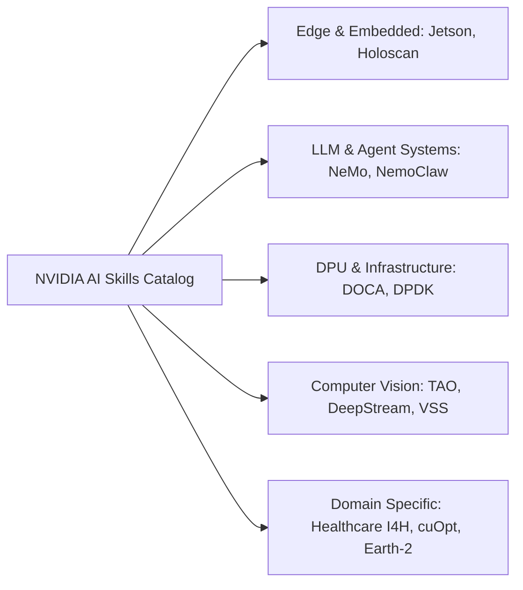

# 🗂️ MCP Cards & NVIDIA AI Skills Catalog

<p align="center">
  
  
  
  
</p>

A curated, production-ready knowledge base containing **450+ verified Model Context Protocol (MCP) server specification cards** and **NVIDIA AI Agent Skills & Solution Blueprints**. 

Every card is crafted in a standardized, atomic Markdown format optimized for both **human developers** and **autonomous AI agents** (Cursor, Claude Desktop, Windsurf, Antigravity, Cline, and RAG pipelines).

---

## 📑 Table of Contents

- [Overview](#-overview)
- [Repository Structure](#-repository-structure)
- [Card Categories](#-card-categories)
  - [1. Verified MCP Servers (102 Cards)](#1-verified-mcp-servers-102-cards)
  - [2. NVIDIA AI Agent Skills (326 Cards)](#2-nvidia-ai-agent-skills-326-cards)
  - [3. NVIDIA Solution Blueprints (31 Cards)](#3-nvidia-solution-blueprints-31-cards)
- [Card Anatomy & Standard Format](#-card-anatomy--standard-format)
- [Quick Start & Integration Guide](#-quick-start--integration-guide)
- [License](#-license)

---

## 🌟 Overview

As agentic AI workflows and LLM tool calling evolve, connecting LLMs to the right tools and domain procedures requires unambiguous, standardized metadata. 

This repository serves as a **unified catalog** providing:
- **Instant Configuration**: Ready-to-copy `mcpServers` JSON snippets for your IDE / AI Agent.
- **Safety Boundaries**: Input constraints, permission models, and error branching.
- **Agent Skill Chaining**: Actionable guides for combining specialized NVIDIA skills with external MCP services.

---

## 📁 Repository Structure

```tree
mcp-cards/
├── README.md                      # Project documentation & catalog index
├── .gitignore                     # Repository whitelist & secret protection
│
├── skills/                        # 428 Skill & MCP Cards
│   ├── mcp-*.md                   # 102 Verified MCP Server Cards (Stripe, GitHub, Supabase, etc.)
│   ├── doca-*.md                  # DOCA DPU & High-Performance Networking Skills (~60)
│   ├── jetson-*.md                # Jetson Embedded & Edge AI Skills (~30)
│   ├── nemo-*.md                  # NeMo LLM Training, Guardrails & Agent Skills (~40)
│   ├── tao-*.md                   # TAO Toolkit Computer Vision & Transfer Learning (~50)
│   ├── vss-*.md                   # Video Search & Summarization (VSS) Skills (~15)
│   ├── holoscan-*.md              # Holoscan Real-time Sensor Processing Skills
│   ├── cuopt-*.md                 # cuOpt Route & Logistics Optimization Skills
│   └── ...                        # Healthcare (I4H), Physical AI, Omniverse, TileGym
│
└── blueprints/
    └── cards/                     # 31 End-to-End Enterprise Solution Blueprint Cards
        ├── build-an-enterprise-rag-pipeline.md
        ├── cosmos-dataset-search.md
        ├── generative-virtual-screening-for-drug-discovery.md
        ├── retail-agentic-commerce.md
        └── ...
```

---

## 🏷️ Card Categories

### 1. Verified MCP Servers (102 Cards)

Located under `skills/mcp-*.md`. Each card provides package source, stdio/SSE transport details, required environment variables, and client JSON config:

| Domain | Key MCP Servers | Example Cards |
|---|---|---|
| **💳 Payments & Billing** | Stripe, PayPal, Chargebee, Adyen, Lemon Squeezy, Paddle | [`mcp-stripe-payments.md`](skills/mcp-stripe-payments.md), [`mcp-paypal-payments.md`](skills/mcp-paypal-payments.md) |
| **⚡ Cloud & Backend** | Azure, Cloudflare, Supabase, Vercel, Convex, Upstash, Fly.io | [`mcp-supabase-backend.md`](skills/mcp-supabase-backend.md), [`mcp-azure-cloud.md`](skills/mcp-azure-cloud.md) |
| **🏗️ DevOps & Infra** | Docker, Kubernetes, Terraform, Pulumi, Vault, ArgoCD, CircleCI | [`mcp-docker-containers.md`](skills/mcp-docker-containers.md), [`mcp-terraform-iac.md`](skills/mcp-terraform-iac.md) |
| **🗄️ Databases & Storage** | PostgreSQL, Redis, MongoDB, Qdrant, Pinecone, ClickHouse, MySQL | [`mcp-postgresql-db.md`](skills/mcp-postgresql-db.md), [`mcp-qdrant-vector.md`](skills/mcp-qdrant-vector.md) |
| **🤖 AI / ML Platforms** | Weights & Biases, MLflow, Hugging Face, Comet, Replicate | [`mcp-wandb-experiment.md`](skills/mcp-wandb-experiment.md), [`mcp-huggingface-hub.md`](skills/mcp-huggingface-hub.md) |
| **📊 Observability & Logs** | Datadog, Sentry, Grafana, OpenTelemetry, New Relic | [`mcp-sentry-errors.md`](skills/mcp-sentry-errors.md), [`mcp-datadog-monitoring.md`](skills/mcp-datadog-monitoring.md) |
| **🔐 Auth & Security** | Auth0, Clerk, Keycloak, Okta, 1Password, Snyk, Semgrep | [`mcp-auth0-authentication.md`](skills/mcp-auth0-authentication.md), [`mcp-snyk-security.md`](skills/mcp-snyk-security.md) |
| **💬 Collaboration & PM** | GitHub, GitLab, Jira/Confluence, Slack, Linear, Notion | [`mcp-github-devops.md`](skills/mcp-github-devops.md), [`mcp-linear-issues.md`](skills/mcp-linear-issues.md) |

---

### 2. NVIDIA AI Agent Skills (326 Cards)

Located under `skills/*.md`. Atomic, task-oriented execution procedures for NVIDIA AI SDKs and acceleration libraries:



- **TAO Toolkit**: AutoML, Vision-Language models (Grounding DINO, OneFormer, DINOv2), Fine-tuning, Dataset conversions.
- **DOCA / BlueField DPU**: Flow acceleration, AES-GCM encryption, DMA, Comch, Telemetry pipelines.
- **NeMo Framework**: Multi-Node training, Megatron-LM optimizations, Alignment (RLHF/DPO), Guardrails.
- **VSS (Video Search & Summarization)**: Detection & tracking, dense captioning, camera calibration, alerting.

---

### 3. NVIDIA Solution Blueprints (31 Cards)

Located under `blueprints/cards/*.md`. End-to-end reference architectures solving complex enterprise problems:

- **Enterprise RAG**: Hybrid Dense+Sparse retrieval, Multimodal ingestion (VLM), SeaweedFS / Milvus integration.
- **Healthcare & Drug Discovery**: Ambient healthcare agents, Generative virtual screening, Evo2 protein design.
- **Physical AI & Digital Twins**: Omniverse DSX AI factories, Isaac GR00T manipulation, fluid simulation.
- **Financial Services**: Fraud detection, quantitative signal discovery, portfolio optimization.

---

## 🔍 Card Anatomy & Standard Format

Every card adheres to a strict, structured layout for predictable parsing:

````markdown
# Skill / MCP Title

## Overview
| Field | Value |
|-------|-------|
| Name | Server / Skill Name |
| Category | Domain Classification |
| Official | ⭐ Official / Community / Reference |
| Source | Repository or Vendor URL |
| Transport | stdio / SSE |
| Install | Package installation command |

## Tools & Capabilities
- Detailed listing of exposed functions, parameters, and return types.

## Client Configuration (JSON)
```json
{
  "mcpServers": {
    "server-name": {
      "command": "npx",
      "args": ["-y", "@vendor/mcp-server"],
      "env": { "API_KEY": "YOUR_KEY_HERE" }
    }
  }
}
```

## Security & Verification Notes
- Permitted scopes, credential boundaries, and automated test checkpoints.
````

---

## 🚀 Quick Start & Integration Guide

### Using with Claude Desktop / Cursor / Antigravity / Windsurf

1. Locate the MCP card you wish to use (e.g., `skills/mcp-supabase-backend.md`).
2. Copy the JSON snippet from the **Client Configuration** section.
3. Paste it into your agent/IDE configuration file:
   - **Claude Desktop**: `~/Library/Application Support/Claude/claude_desktop_config.json` (macOS)
   - **Cursor**: `Settings -> Features -> MCP Servers`
   - **Antigravity / Kiro**: `.kiro/settings/mcp.json` or global MCP settings
4. Set the required API credentials in your environment or `env` block.

---

## 📄 License

This repository is distributed under the **MIT License**. Third-party logos, trademark names, and external MCP implementations belong to their respective owners.
