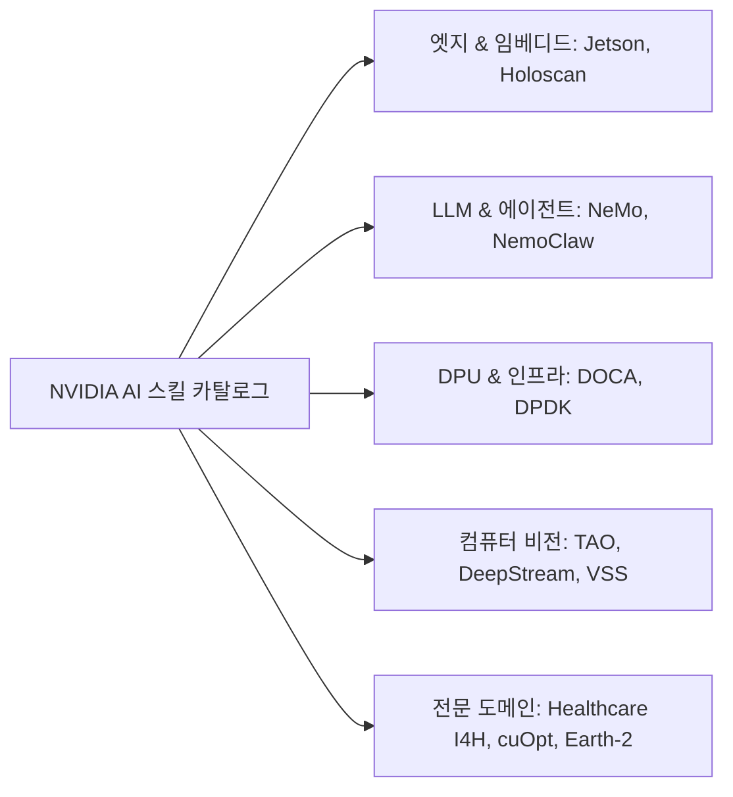

# 🗂️ MCP 카드 & NVIDIA AI 스킬 종합 카탈로그

<p align="center">
  <a href="README.md">English</a> | <b>한국어</b>
</p>

<p align="center">
  
  
  
  
</p>

**450개 이상의 검증된 Model Context Protocol (MCP) 서버 명세 카드**와 **NVIDIA AI 에이전트 스킬 및 엔터프라이즈 솔루션 블루프린트**를 집대성한 프로덕션 레디 지식 베이스입니다.

모든 카드는 **인간 개발자**와 **자율형 AI 에이전트**(Cursor, Claude Desktop, Windsurf, Antigravity, Cline 및 RAG 파이프라인) 모두가 즉시 파싱하고 활용할 수 있는 표준 원자적(Atomic) 마크다운 규격으로 제작되었습니다.

---

## 📑 목차

- [개요](#-개요)
- [저장소 구조](#-저장소-구조)
- [카드 카테고리 분류](#-카드-카테고리-분류)
  - [1. 검증된 외부 MCP 서버 카드 (102개)](#1-검증된-외부-mcp-서버-카드-102개)
  - [2. NVIDIA AI 에이전트 스킬 카드 (326개)](#2-nvidia-ai-에이전트-스킬-카드-326개)
  - [3. NVIDIA 솔루션 블루프린트 카드 (31개)](#3-nvidia-솔루션-블루프린트-카드-31개)
- [카드 표준 규격 (Anatomy)](#-카드-표준-규격-anatomy)
- [빠른 시작 및 클라이언트 연동 가이드](#-빠른-시작-및-클라이언트-연동-가이드)
- [라이선스](#-라이선스)

---

## 🌟 개요

에이전트 기반 AI 워크플로우와 LLM Tool Calling 환경에서, LLM이 올바른 도구와 전문 도메인 프로시저를 정확하게 호출하려면 모호함 없는 표준화된 메타데이터가 필수적입니다.

본 저장소는 다음과 같은 핵심 가치를 제공하는 **통합 카탈로그** 역할을 수행합니다:
- **즉시 사용 가능한 설정**: IDE 및 AI 에이전트에 바로 복사해 넣을 수 있는 `mcpServers` JSON 스니펫 제공.
- **명확한 보안 및 실행 경계**: 허용 스코프, 인증 처리 방식, 오류 분기 처리 가이드 수록.
- **에이전트 스킬 체이닝**: 전문 NVIDIA SDK 스킬과 외부 MCP 서비스를 결합한 고도화 워크플로우 지원.

---

## 📁 저장소 구조

```tree
mcp-cards/
├── README.md                      # 영문 카탈로그 문서
├── README_KO.md                   # 한국어 카탈로그 문서 (본 파일)
├── .gitignore                     # 저장소 화이트리스트 및 보안 파일 제외 설정
│
├── skills/                        # 428개 스킬 & MCP 카드
│   ├── mcp-*.md                   # 102개 검증된 외부 MCP 서버 카드 (Stripe, GitHub, Supabase 등)
│   ├── doca-*.md                  # DOCA DPU & 고성능 네트워킹 스킬 (~60개)
│   ├── jetson-*.md                # Jetson 임베디드 & 엣지 AI 스킬 (~30개)
│   ├── nemo-*.md                  # NeMo LLM 분산학습, 가드레일 & 에이전트 스킬 (~40개)
│   ├── tao-*.md                   # TAO 툴킷 컴퓨터 비전 & 전이학습 스킬 (~50개)
│   ├── vss-*.md                   # 비디오 검색 및 요약(VSS) 스킬 (~15개)
│   ├── holoscan-*.md              # Holoscan 실시간 센서 스트리밍 처리 스킬
│   ├── cuopt-*.md                 # cuOpt 경로 및 물류 수치 최적화 스킬
│   └── ...                        # 헬스케어(I4H), Physical AI, Omniverse, TileGym 등
│
└── blueprints/
    └── cards/                     # 31개 엔드투엔드 엔터프라이즈 솔루션 블루프린트 카드
        ├── build-an-enterprise-rag-pipeline.md
        ├── cosmos-dataset-search.md
        ├── generative-virtual-screening-for-drug-discovery.md
        ├── retail-agentic-commerce.md
        └── ...
```

---

## 🏷️ 카드 카테고리 분류

### 1. 검증된 외부 MCP 서버 카드 (102개)

`skills/mcp-*.md` 경로에 위치하며, 패키지 소스, 전송 방식(stdio/SSE), 필수 환경 변수, 클라이언트 JSON 설정을 제공합니다:

| 도메인 | 대표 MCP 서버 | 예시 카드 |
|---|---|---|
| **💳 결제 및 빌링** | Stripe, PayPal, Chargebee, Adyen, Lemon Squeezy, Paddle | [`mcp-stripe-payments.md`](skills/mcp-stripe-payments.md), [`mcp-paypal-payments.md`](skills/mcp-paypal-payments.md) |
| **⚡ 클라우드 & 백엔드** | Azure, Cloudflare, Supabase, Vercel, Convex, Upstash, Fly.io | [`mcp-supabase-backend.md`](skills/mcp-supabase-backend.md), [`mcp-azure-cloud.md`](skills/mcp-azure-cloud.md) |
| **🏗️ DevOps & 인프라** | Docker, Kubernetes, Terraform, Pulumi, Vault, ArgoCD, CircleCI | [`mcp-docker-containers.md`](skills/mcp-docker-containers.md), [`mcp-terraform-iac.md`](skills/mcp-terraform-iac.md) |
| **🗄️ 데이터베이스 & 스토리지** | PostgreSQL, Redis, MongoDB, Qdrant, Pinecone, ClickHouse, MySQL | [`mcp-postgresql-db.md`](skills/mcp-postgresql-db.md), [`mcp-qdrant-vector.md`](skills/mcp-qdrant-vector.md) |
| **🤖 AI / ML 플랫폼** | Weights & Biases, MLflow, Hugging Face, Comet, Replicate | [`mcp-wandb-experiment.md`](skills/mcp-wandb-experiment.md), [`mcp-huggingface-hub.md`](skills/mcp-huggingface-hub.md) |
| **📊 관측성 & 모니터링** | Datadog, Sentry, Grafana, OpenTelemetry, New Relic | [`mcp-sentry-errors.md`](skills/mcp-sentry-errors.md), [`mcp-datadog-monitoring.md`](skills/mcp-datadog-monitoring.md) |
| **🔐 인증 & 보안** | Auth0, Clerk, Keycloak, Okta, 1Password, Snyk, Semgrep | [`mcp-auth0-authentication.md`](skills/mcp-auth0-authentication.md), [`mcp-snyk-security.md`](skills/mcp-snyk-security.md) |
| **💬 협업 & 프로젝트 관리** | GitHub, GitLab, Jira/Confluence, Slack, Linear, Notion | [`mcp-github-devops.md`](skills/mcp-github-devops.md), [`mcp-linear-issues.md`](skills/mcp-linear-issues.md) |

---

### 2. NVIDIA AI 에이전트 스킬 카드 (326개)

`skills/*.md` 경로에 위치하며, NVIDIA AI 가속 SDK 및 라이브러리의 원자적 작업 실행 프로시저를 정의합니다:



- **TAO 툴킷**: AutoML, Vision-Language 모델(Grounding DINO, OneFormer, DINOv2), 미세조정, 데이터셋 변환.
- **DOCA / BlueField DPU**: 플로우 가속, AES-GCM 하드웨어 암호화, DMA, Comch, 텔레메트리 파이프라인.
- **NeMo 프레임워크**: 멀티 노드 분산 학습, Megatron-LM 병렬화 최적화, 정렬(RLHF/DPO), 가드레일.
- **VSS (Video Search & Summarization)**: 객체 검출 및 추적, 캡셔닝, 카메라 캘리브레이션, 실시간 알림.

---

### 3. NVIDIA 솔루션 블루프린트 카드 (31개)

`blueprints/cards/*.md` 경로에 위치하며, 복잡한 엔터프라이즈 문제를 해결하기 위한 완결형 참조 아키텍처를 제공합니다:

- **엔터프라이즈 RAG**: 하이브리드 Dense+Sparse 검색, 멀티모달 VLM 인제스천, SeaweedFS / Milvus 연동.
- **헬스케어 & 신약 개발**: 앰비언트 헬스케어 임상 에이전트, 가상 스크리닝, Evo2 단백질 설계.
- **Physical AI & 디지털 트윈**: Omniverse DSX AI 팩토리, Isaac GR00T 합성 조작, 유체 시뮬레이션.
- **금융 서비스**: 금융 사기 탐지, 퀀트 시그널 디스커버리, 포트폴리오 최적화.

---

## 🔍 카드 표준 규격 (Anatomy)

모든 카드는 일관된 자동 파싱을 위해 다음과 같은 표준 마크다운 구조를 준수합니다:

````markdown
# 스킬 / MCP 제목

## Overview (개요)
| 필드 | 값 |
|-------|-------|
| Name | 서버 / 스킬 명칭 |
| Category | 도메인 카테고리 |
| Official | ⭐ 공식(Official) / 커뮤니티 / 레퍼런스 |
| Source | 저장소 또는 벤더 공식 URL |
| Transport | stdio / SSE |
| Install | 패키지 설치 명령어 |

## Tools & Capabilities (주요 도구 및 기능)
- 노출되는 함수 명세, 파라미터 타입, 반환값 설명.

## Client Configuration (JSON 설정 예시)
```json
{
  "mcpServers": {
    "server-name": {
      "command": "npx",
      "args": ["-y", "@vendor/mcp-server"],
      "env": { "API_KEY": "YOUR_KEY_HERE" }
    }
  }
}
```

## Security & Verification Notes (보안 및 검증 사항)
- 허용된 권한 범위, 자격 증명 경계, 자동화 검증 포인트 명시.
````

---

## 🚀 빠른 시작 및 클라이언트 연동 가이드

### Claude Desktop / Cursor / Antigravity / Windsurf 연동법

1. 연동하고자 하는 MCP 카드를 선택합니다 (예: `skills/mcp-supabase-backend.md`).
2. 카드의 **Client Configuration** 섹션에 있는 JSON 스니펫을 복사합니다.
3. 사용 중인 IDE / 에이전트의 설정 파일에 추가합니다:
   - **Claude Desktop**: `~/Library/Application Support/Claude/claude_desktop_config.json` (macOS)
   - **Cursor**: `Settings -> Features -> MCP Servers`
   - **Antigravity / Kiro**: `.kiro/settings/mcp.json` 또는 글로벌 MCP 설정
4. 필요한 API 자격 증명을 환경 변수 또는 `env` 블록에 기입합니다.

---

## 📄 라이선스

본 저장소는 **MIT 라이선스**에 따라 배포됩니다. 서드파티 로고, 상표명 및 외부 MCP 서버 구현체의 지적재산권은 해당 원저작자에게 귀속됩니다.
